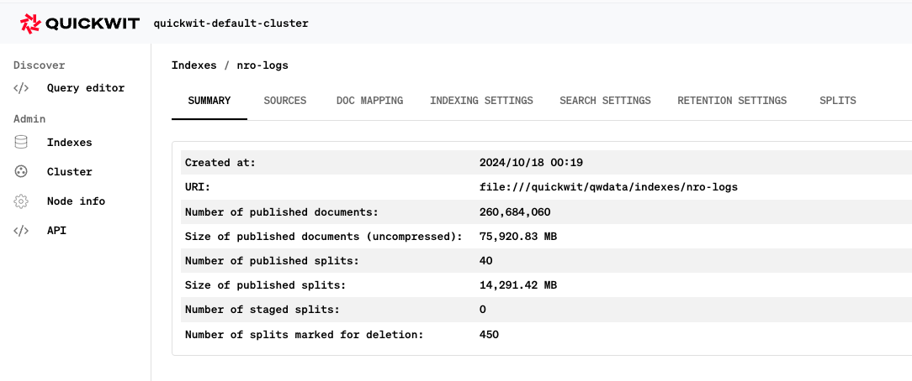
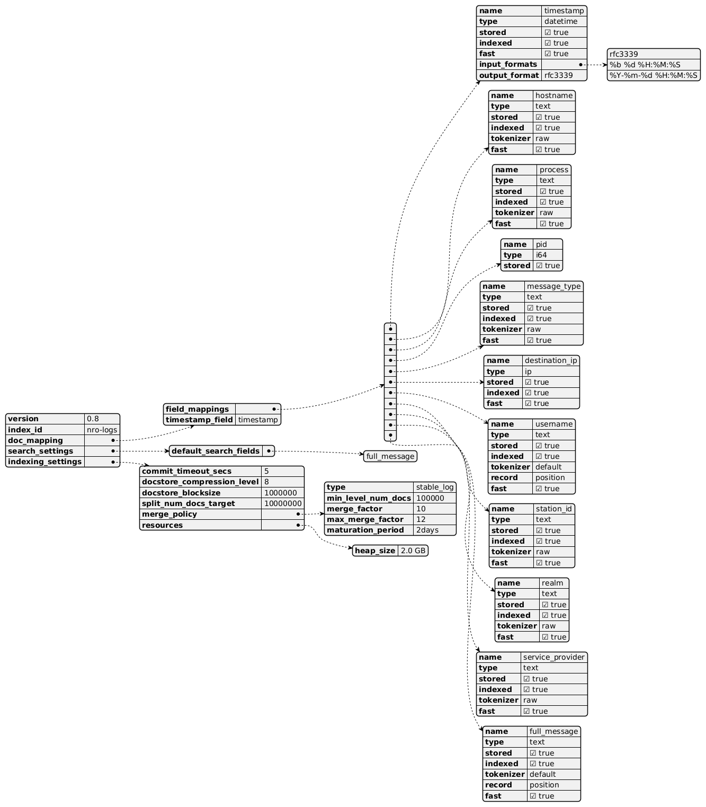
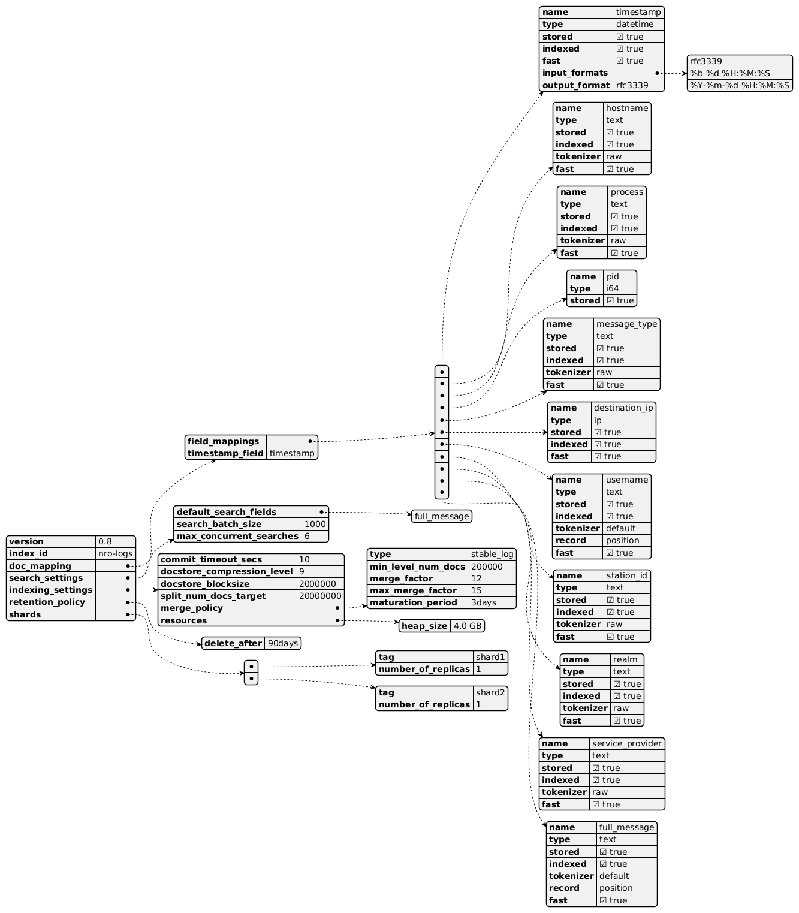

>> 20241020

## ปัญหาเกี่ยวกับ bucket limit หรือต้องการ optimize การ query สำหรับข้อมูลขนาดใหญ่ใน Quickwit

- Log lines: 260M docs 
- Data size: ~76GB

ข้อเสนอเบื้องต้น:

1. ปรับแต่ง index configuration:
   - ตรวจสอบและปรับ `indexing_settings` ใน config file เช่น เพิ่ม `max_merge_factor` หรือ `min_num_segments` เพื่อควบคุมขนาดของ segment

2. Optimize queries:
   - ใช้ field-specific queries แทน full-text search เมื่อเป็นไปได้
   - ใช้ term queries แทน prefix queries สำหรับ high-cardinality fields
   - หลีกเลี่ยงการใช้ wildcard queries (*) มากเกินไป

3. Sharding:
   - พิจารณาแบ่ง index ออกเป็น shards หลายๆ อัน เพื่อกระจายข้อมูลและการ query

4. Caching:
   - เพิ่ม caching layer เช่น Redis เพื่อ cache ผลลัพธ์ของ queries ที่ใช้บ่อย

5. Hardware:
   - ตรวจสอบว่า hardware ที่ใช้ (CPU, RAM, storage) เพียงพอสำหรับขนาดข้อมูลของคุณหรือไม่

6. Monitoring:
   - ใช้ tools เช่น Prometheus และ Grafana (ที่คุณมีใน setup) เพื่อ monitor performance และระบุ bottlenecks

7. Indexing strategy:
   - ทบทวน indexing strategy ว่าเหมาะสมกับ use case ของคุณหรือไม่ อาจต้องปรับ field types หรือ analyzers

สุดท้าย แนะนำให้เตรียมข้อมูลต่อไปนี้ก่อนหารือกับทีม admin:
- ขนาดของข้อมูลทั้งหมด
- จำนวน documents
- ลักษณะของ queries ที่ใช้บ่อย
- Current performance metrics
- รายละเอียดของ hardware และ configuration ที่ใช้อยู่

ข้อมูลเหล่านี้จะช่วยให้การหารือมีประสิทธิภาพและได้คำแนะนำที่เหมาะสมที่สุด

---

## ปัญหานี้เกี่ยวข้องกับการ configure index มากกว่าตัว Quickwit engine โดยตรง 
- จาก [configuration](./misc/old_index.md) มีข้อเสนอแนะดังนี้:
- 

1. ปรับ `indexing_settings`:

   ```json
   "indexing_settings": {
     "commit_timeout_secs": 10,
     "split_num_docs_target": 20000000,
     "merge_policy": {
       "type": "stable_log",
       "min_level_num_docs": 200000,
       "merge_factor": 12,
       "max_merge_factor": 15,
       "maturation_period": "3days"
     },
     "resources": {
       "heap_size": "4.0 GB"
     }
   }
   ```

   - เพิ่ม `commit_timeout_secs` เพื่อลดความถี่ในการ commit
   - เพิ่ม `split_num_docs_target` เพื่อให้แต่ละ split มีขนาดใหญ่ขึ้น
   - ปรับ `merge_policy` เพื่อลดความถี่ในการ merge และเพิ่มประสิทธิภาพ
   - เพิ่ม `heap_size` ถ้าระบบของคุณมี RAM เพียงพอ

2. ปรับ `search_settings`:

   ```json
   "search_settings": {
     "default_search_fields": ["full_message"],
     "search_batch_size": 1000,
     "max_concurrent_searches": 6
   }
   ```

   - เพิ่ม `search_batch_size` เพื่อเพิ่มประสิทธิภาพในการค้นหา
   - กำหนด `max_concurrent_searches` เพื่อควบคุมการใช้ทรัพยากร

3. ทบทวน `field_mappings`:
   - สำหรับ fields ที่ไม่จำเป็นต้องค้นหาแบบ full-text อาจเปลี่ยน `tokenizer` เป็น "raw" เพื่อประหยัดพื้นที่และเพิ่มประสิทธิภาพ
   - พิจารณาว่า fields ไหนจำเป็นต้องมี `record: "position"` จริงๆ เพราะมันจะใช้พื้นที่เพิ่มขึ้น

4. เพิ่ม `retention_policy` ถ้าต้องการจัดการข้อมูลเก่า:

   ```json
   "retention_policy": {
     "delete_after": "90days"
   }
   ```

5. ถ้าข้อมูลมีขนาดใหญ่มาก อาจพิจารณาใช้ `shards`:

   ```json
   "shards": [
     {
       "tag": "shard1",
       "number_of_replicas": 1
     },
     {
       "tag": "shard2",
       "number_of_replicas": 1
     }
   ]
   ```

นอกจากนี้ ควรพิจารณาการ optimize ที่ระดับ hardware และ system configuration ด้วย เช่น:

- เพิ่ม RAM ให้กับ server
- ใช้ SSD แทน HDD สำหรับ storage
- ปรับแต่ง OS parameters เช่น `max_open_files`, `vm.max_map_count` ใน Linux

สุดท้าย อย่าลืมว่าการ optimize เป็นกระบวนการต่อเนื่อง อาจต้องทดลองปรับค่าต่างๆ และ monitor performance อย่างต่อเนื่องเพื่อหาค่าที่เหมาะสมที่สุดสำหรับ use case นั้นๆ

---

## ปรับปรุง index configuration ให้สอดคล้อง:


```json
{
  "version": "0.8",
  "index_id": "nro-logs",
  "doc_mapping": {
    "field_mappings": [
      {
        "name": "timestamp",
        "type": "datetime",
        "stored": true,
        "indexed": true,
        "fast": true,
        "input_formats": ["rfc3339", "%b %d %H:%M:%S", "%Y-%m-%d %H:%M:%S"],
        "output_format": "rfc3339"
      },
      {
        "name": "hostname",
        "type": "text",
        "stored": true,
        "indexed": true,
        "tokenizer": "raw",
        "fast": true
      },
      {
        "name": "process",
        "type": "text",
        "stored": true,
        "indexed": true,
        "tokenizer": "raw",
        "fast": true
      },
      {
        "name": "pid",
        "type": "i64",
        "stored": true
      },
      {
        "name": "message_type",
        "type": "text",
        "stored": true,
        "indexed": true,
        "tokenizer": "raw",
        "fast": true
      },
      {
        "name": "destination_ip",
        "type": "ip",
        "stored": true,
        "indexed": true,
        "fast": true
      },
      {
        "name": "username",
        "type": "text",
        "stored": true,
        "indexed": true,
        "tokenizer": "default",
        "record": "position",
        "fast": true
      },
      {
        "name": "station_id",
        "type": "text",
        "stored": true,
        "indexed": true,
        "tokenizer": "raw",
        "fast": true
      },
      {
        "name": "realm",
        "type": "text",
        "stored": true,
        "indexed": true,
        "tokenizer": "raw",
        "fast": true
      },
      {
        "name": "service_provider",
        "type": "text",
        "stored": true,
        "indexed": true,
        "tokenizer": "raw",
        "fast": true
      },
      {
        "name": "full_message",
        "type": "text",
        "stored": true,
        "indexed": true,
        "tokenizer": "default",
        "record": "position",
        "fast": true
      }
    ],
    "timestamp_field": "timestamp"
  },
  "search_settings": {
    "default_search_fields": ["full_message"],
    "search_batch_size": 1000,
    "max_concurrent_searches": 6
  },
  "indexing_settings": {
    "commit_timeout_secs": 10,
    "docstore_compression_level": 9,
    "docstore_blocksize": 2000000,
    "split_num_docs_target": 20000000,
    "merge_policy": {
      "type": "stable_log",
      "min_level_num_docs": 200000,
      "merge_factor": 12,
      "max_merge_factor": 15,
      "maturation_period": "3days"
    },
    "resources": {
      "heap_size": "4.0 GB"
    }
  },
  "retention_policy": {
    "delete_after": "90days"
  },
  "shards": [
    {
      "tag": "shard1",
      "number_of_replicas": 1
    },
    {
      "tag": "shard2",
      "number_of_replicas": 1
    }
  ]
}

```

การเปลี่ยนแปลงหลักๆ และเหตุผล:

1. เพิ่ม `search_settings`: ปรับแต่งการค้นหาให้มีประสิทธิภาพมากขึ้น
2. ปรับ `indexing_settings`:
   - เพิ่ม `commit_timeout_secs` เพื่อลดความถี่ในการ commit
   - เพิ่ม `docstore_compression_level` เพื่อประหยัดพื้นที่มากขึ้น
   - เพิ่ม `docstore_blocksize` และ `split_num_docs_target` เพื่อรองรับข้อมูลขนาดใหญ่
   - ปรับ `merge_policy` เพื่อลดความถี่ในการ merge และเพิ่มประสิทธิภาพ
   - เพิ่ม `heap_size` เพื่อรองรับการประมวลผลข้อมูลขนาดใหญ่
3. เพิ่ม `retention_policy`: จัดการข้อมูลเก่าอัตโนมัติ
4. เพิ่ม `shards`: กระจายข้อมูลและการค้นหา

ข้อควรระวัง:
- การเพิ่ม `heap_size` ต้องแน่ใจว่าระบบมี RAM เพียงพอ
- การใช้ `shards` อาจต้องการทรัพยากรเพิ่มเติม แต่จะช่วยในการ scale
- `retention_policy` จะลบข้อมูลเก่า ต้องแน่ใจว่าตรงตามความต้องการ

ควรพิจารณาค่าต่างๆ เหล่านี้ร่วมกับข้อมูลการใช้งานจริง และอาจต้องปรับแต่งเพิ่มเติมตามลักษณะข้อมูลและทรัพยากรที่มี

---
